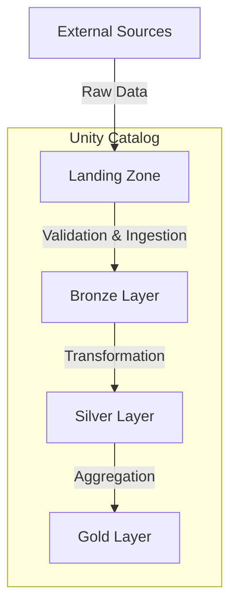
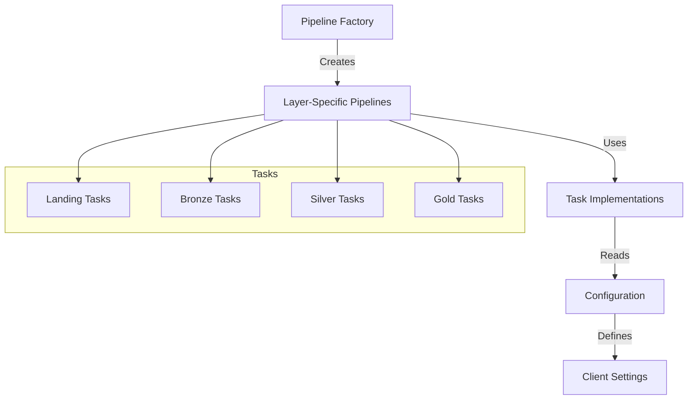

# LocalBricks: Databricks Asset Bundle Manager

## Introduction

LocalBricks is a Python library designed to manage and interact with Databricks Asset Bundles, focusing on data pipeline management and Unity Catalog integration. The project implements a medallion architecture pattern (landing, bronze, silver, gold) for data processing in Databricks environments.

## Architecture

### Data Flow Architecture



### Component Architecture



## Modules

### 1. Workspace Preparation (`src/prepare_databricks_workspace/`)
- **setup_unity_catalog.py**: Configures Unity Catalog with proper data organization
  - Creates catalogs for different layers (landing, bronze, silver, gold)
  - Sets up external locations for S3 integration
  - Manages schema creation and volume mounting
  - Handles client-specific configurations

### 2. Task Layers (`src/tasks/`)
- **Landing Layer**: Initial data ingestion from external sources
  - Handles multiple file formats (CSV, JSON)
  - Implements incremental loading
  - Tracks file processing status

- **Bronze Layer**: Raw data validation and standardization
  - Implements data source-specific parsing
  - Handles different data sources and formats
  - Merges data for silver layer processing

- **Silver Layer**: Business logic implementation
  - Data transformation and enrichment
  - Relationship mapping between different data sources

- **Gold Layer**: Analytics-ready data
  - Aggregated views
  - Business metrics calculation

### 3. Resource Configuration (`resources/`)
- **jobs.yml**: Defines Databricks job configurations
  - Task dependencies and execution flow
  - Cluster configurations
  - Environment-specific parameters

## Current Dependencies and Improvement Areas

1. **Client Coupling**
   - Current implementation needs better abstraction for client-specific logic
   - Need to abstract client-specific logic into configuration files
   - Implement more generic data processing patterns

2. **Configuration Management**
   - Move client-specific settings to external configuration
   - Implement a more flexible configuration system
   - Add validation for configuration files

3. **Error Handling**
   - Implement comprehensive error handling
   - Add retry mechanisms for failed tasks
   - Improve logging and monitoring

4. **Modularity**
   - Extract common functionality into reusable components
   - Implement interfaces for different data sources
   - Create pluggable transformation modules

## Usage

### 1. Setting Up Unity Catalog

```python
# Configure workspace environment
ws_env = 'dev'  # Options: dev/qa/production
ws_storage_credentials = 'your-storage-credentials'

# Create necessary catalogs and schemas
create_landing_zone(
    ws_env='dev',
    metastore_industry='your_industry',
    client_code='CLIENT',
    s3_bucket='s3://your-bucket'
)
```

### 2. Implementing Data Pipeline

```python
# Create a new pipeline
from deus_lib.abstract.pipeline_factory import PipelineFactory

def main():
    layer = 'landing_layer'  # or bronze/silver/gold
    pipeline = PipelineFactory().create_pipeline(layer=layer)
    pipeline.main()
```

### 3. Configuring Jobs

```yaml
job_name:
  parameters:
    - name: customer_code
      default: CLIENT_CODE
    - name: industry
      default: INDUSTRY_TYPE
  tasks:
    - task_key: data_source_task
      description: Process specific data source
      spark_python_task:
        python_file: path/to/task.py
        parameters:
          - your_parameters
```

## Recommendations for Generalization

1. **Configuration Abstraction**
   - Create a configuration management system
   - Support multiple configuration formats
   - Implement environment-specific configurations

2. **Client Abstraction**
   - Create interfaces for client-specific operations
   - Implement adapter pattern for different data sources
   - Move client-specific logic to plugins

3. **Pipeline Flexibility**
   - Make pipeline steps configurable
   - Support custom transformation logic
   - Implement pipeline validation

4. **Testing and Validation**
   - Add unit tests for core components
   - Implement integration tests
   - Add data quality checks

5. **Documentation**
   - Add detailed API documentation
   - Create usage examples
   - Document configuration options 